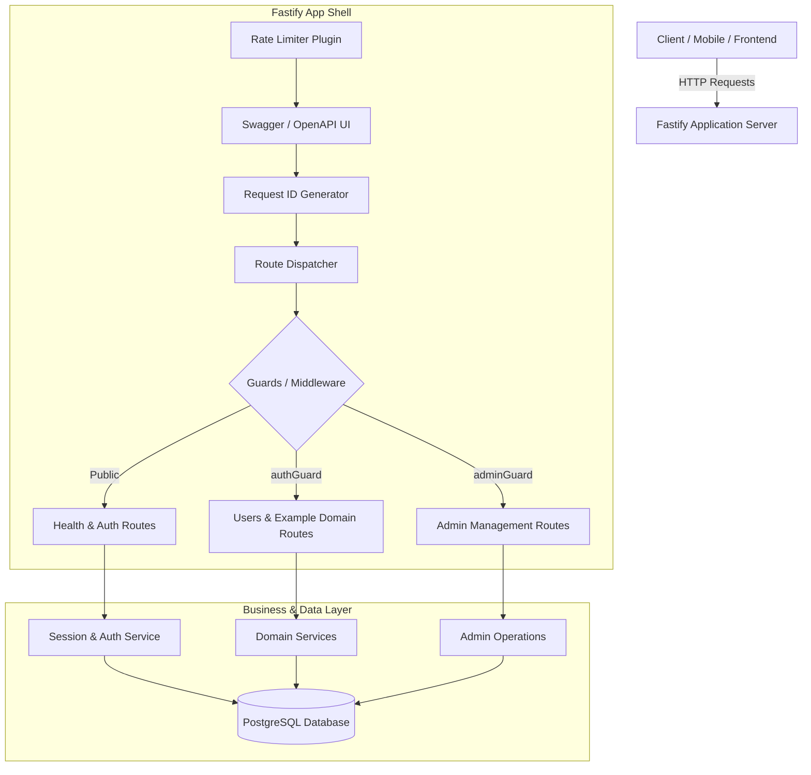
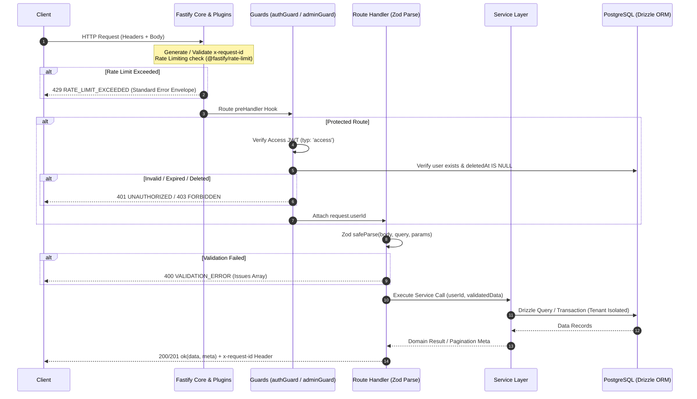
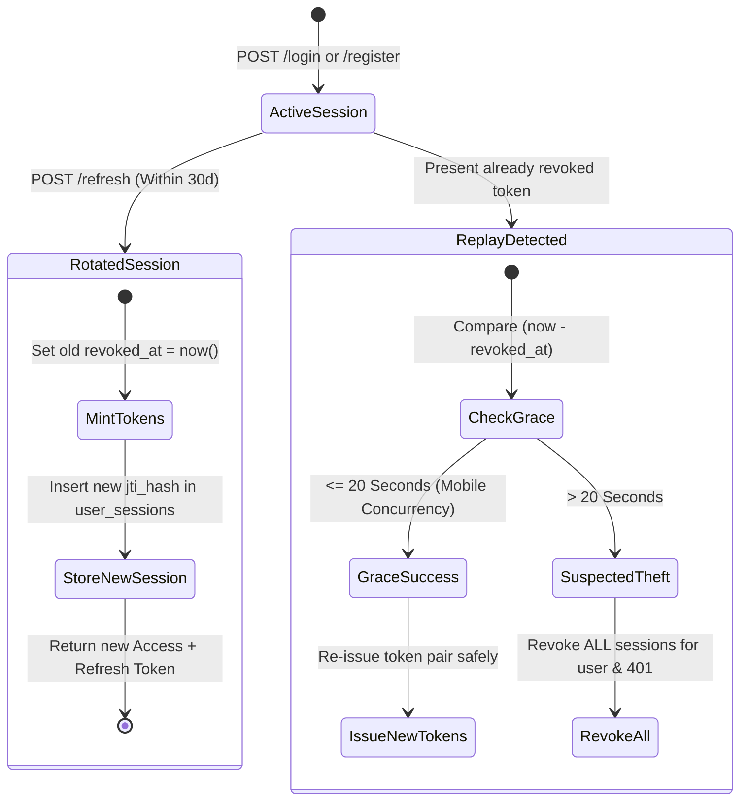
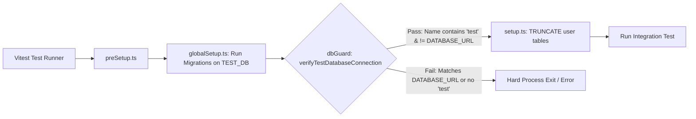

# App Factory Backend Starter Kit — Architecture Specification (`ARCHITECTURE.md`)

## 1. System Overview

The **App Factory Backend Starter Kit** is a robust, modular, and performant backend foundation built with Node.js, Fastify, TypeScript, Drizzle ORM, and PostgreSQL. It is engineered to power microservices and monolithic backends generated by the App Factory pipeline.

---

## 2. Request Lifecycle

Every incoming HTTP request passes through a strictly defined pipeline ensuring safety, observability, tenant isolation, and predictable responses:

---

## 3. Authentication & Refresh Session Architecture

The Starter Kit implements an industry-standard dual-token authentication model with PostgreSQL-backed session rotation and replay detection.

### Token Specs
| Token Type | Lifetime | Secret / Key | Payload Claims | Storage |
| :--- | :--- | :--- | :--- | :--- |
| **Access Token** | 15 minutes | `JWT_SECRET` | `{ userId, typ: "access" }` | In-memory / Authorization Header |
| **Refresh Token** | 30 days | `JWT_SECRET` | `{ userId, jti, typ: "refresh" }` | Secure HttpOnly Cookie / Client Storage |

### Session Table (`user_sessions`)
- Stores SHA-256 hash of the `jti` (`jti_hash`), `user_id`, `expires_at`, `created_at`, and `revoked_at`.
- Enables explicit logout and administrator revocation of all sessions for compromised accounts.

### Refresh Rotation & Replay Protection Workflow

---

## 4. Role-Based Access Control (RBAC) & Admin Hierarchy

The starter kit defines two distinct user roles in PostgreSQL via the `role` enum column:
- `user`: Standard application tenant.
- `admin`: Elevated administrative operator.

### Guard Model
- `authGuard`: Requires valid Access JWT, checks non-deleted user, sets `request.userId`.
- `adminGuard`: Requires `authGuard`, enforces `user.role === 'admin'`.

### Safety Gates on Admin Mutations
- **Self-Demotion Prevention**: Administrators cannot demote their own account from `admin` to `user`.
- **Last Admin Lockout Prevention**: Cannot demote the last remaining active administrator in the database.
- **Immediate Session Revocation**: When an admin updates a user role, soft-deletes a user, or triggers `POST /admin/users/:id/revoke-sessions`, all active sessions for that user are immediately invalidated.

---

## 5. Database, Drizzle ORM & Migrations

### Architecture
- **PostgreSQL Connection Pool**: Managed via `pg.Pool` in [`src/db/connection.ts`](file:///d:/App-factory(starter-kit)/src/db/connection.ts) with centralized lifecycle shutdown in [`src/server.ts`](file:///d:/App-factory(starter-kit)/src/server.ts).
- **ORM**: Drizzle ORM provides type-safe SQL query generation without heavy ORM overhead.
- **Transactions & Concurrency**: Critical mutations (e.g., refresh-token rotation) utilize `db.transaction()` and `FOR UPDATE` row locks to eliminate race conditions.
- **Soft Deletion**: Entities (`users`, `examples`) use timestamp column `deleted_at`. Unique partial indexes (e.g., `uniqueIndex('users_email_active_unique').on(table.email).where(sql\`${table.deletedAt} IS NULL\`)`) ensure deleted emails can be re-registered.

### Migration Management
- Schemas are defined in [`src/db/schema.ts`](file:///d:/App-factory(starter-kit)/src/db/schema.ts).
- Drizzle Kit translates TypeScript schemas into SQL migrations in `drizzle/`.
- Migrations are applied in production/staging via `npm run db:migrate`.

---

## 6. Test Isolation Architecture

The test suite enforces a zero-tolerance database safety boundary:

---

## 7. Cross-Cutting Utilities & Plugins

### Pagination (`src/utils/pagination.ts`)
- **Cursor Pagination**: Optimized for infinite scrolling and high-throughput feeds. Emits opaque Base64 URL-safe tokens containing cursor values.
- **Limit-Offset Pagination**: Traditional pagination providing `total`, `limit`, `offset`, and `hasMore`.

### Rate Limiting (`src/plugins/rateLimiter.ts`)
- Fastify plugin wrapping `@fastify/rate-limit`.
- Defaults to `100 req/min` globally.
- Applied selectively with stricter rules (e.g., `10 req/min`) on auth endpoints (`/register`, `/login`).

### OpenAPI & Swagger UI (`src/plugins/swagger.ts`)
- Dynamically derives OpenAPI 3.0.3 contracts directly from Fastify route schemas.
- Interactive Swagger UI available at `/docs`.
- Raw OpenAPI JSON available at `/docs/json`.
- Exposes `bearerAuth` security scheme for interactive testing.

---

## 8. Implemented Features vs. Future Roadmap

| Feature / Capability | Status | Implementation Details |
| :--- | :--- | :--- |
| **Fastify App Shell & Error Handling** | **Implemented** | `src/app.ts`, `src/utils/response.ts` |
| **Environment Validation** | **Implemented** | `src/config/env.ts` (Zod validation) |
| **PostgreSQL & Drizzle ORM** | **Implemented** | `src/db/schema.ts`, `drizzle/` migrations |
| **Access & Refresh JWT Auth** | **Implemented** | `src/auth/jwt.ts`, `src/auth/sessionService.ts` |
| **Single-Use Refresh & Replay Protection** | **Implemented** | 20s grace window, `user_sessions` |
| **RBAC (User & Admin Roles)** | **Implemented** | `src/middleware/adminGuard.ts`, `src/routes/admin.ts` |
| **Reusable Pagination Utility** | **Implemented** | Cursor & limit-offset in `src/utils/pagination.ts` |
| **Canonical Example CRUD Module** | **Implemented** | `src/modules/example/` |
| **OpenAPI 3.0.3 & Swagger UI** | **Implemented** | `@fastify/swagger` mounted at `/docs` |
| **Rate Limiting** | **Implemented** | `@fastify/rate-limit` in `src/plugins/rateLimiter.ts` |
| **Integration Test Suite** | **Implemented** | 100% passing tests with DB isolation guards |
| **Docker Compose Containerization** | *Planned* | Containerized Postgres and app images |
| **GitHub Actions CI/CD** | *Planned* | Automated lint, build, and test pipeline |
